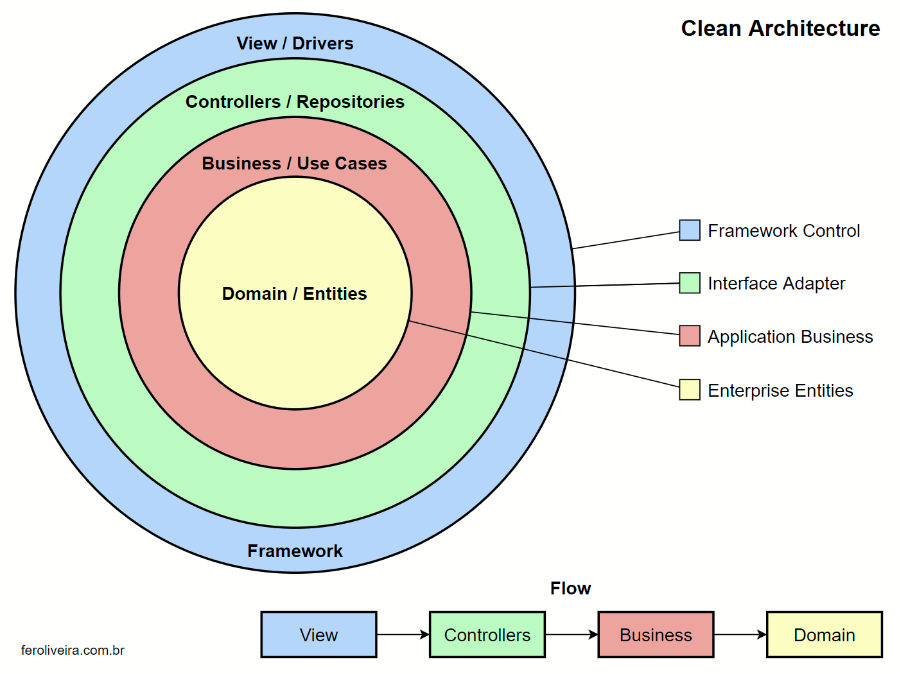

## Software para cadastro de produtos.
- Este software tem como objetivo implementar o modelo Clean Architecture no framework Laravel 8.0.

### Pacotes
 - PHP 7.4
 - Laravel 8.0
 - Composer 2

### Instalar
    - composer run-script install
    - php artisan serve

### Estrutura de Pastas
    - app
        - Business (UseCases)
            - Products
        - Domain (Entities)
            - Products
        - Http (Infra)
            - Controllers
            - Repositories
            - Models

### Padrão Estrutural

Fernando Oliveira - [feroliveira.com.br](http://feroliveira.com.br)